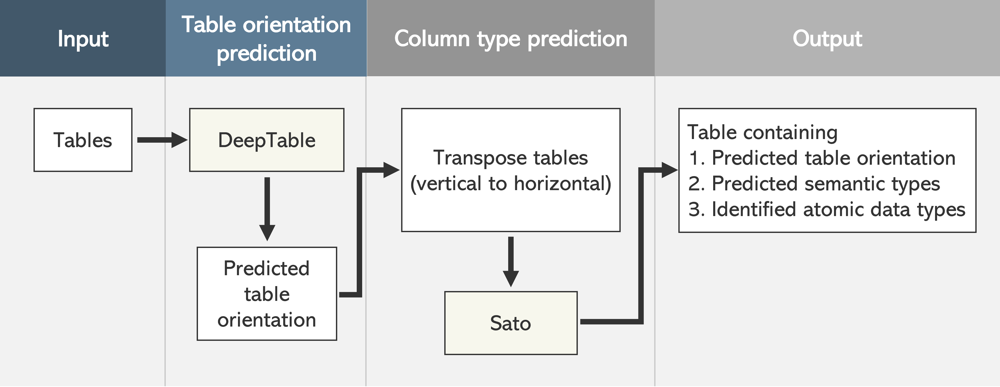
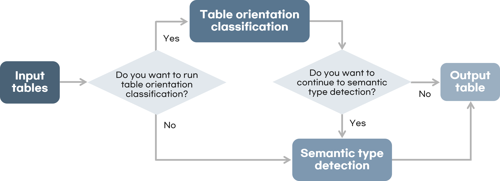

### Development and Evaluation of a Machine Learning Toolbox for Medical Data Integration

### Goal
> Automation of tasks to integrate digital health data </br>
> Create an integrated table of good quality with the application of machine learning

### Workflow of Toolbox




````diff
- Input
EHR tables in csv format

- DeepTable
Classify table orientation (horizontal or vertical or matrix)
Transform table to horizontal if it isn’t

- Sato
Detect semantic type of columns
Types : date of birth, date of death, patient id, medication, clinical notes, etc.
````


##### Tools

***Sato: Contextual Semantic Type Detection in Tables (2020)*** [link](http://www.vldb.org/pvldb/vol13/p1835-zhang.pdf)
> <sup> [Sato github](https://github.com/megagonlabs/sato) </br>
> [Sherlock github](https://github.com/mitmedialab/sherlock-project) </sup>

***DeepTable: a permutation invariant neural network for table orientation classification (2020)*** [link](https://link.springer.com/content/pdf/10.1007/s10618-020-00711-x.pdf)
> <sup> [DeepTable github](https://github.com/Marhabibi/DeepTable) </sup>

##### Databases

synthetic EHR [Synthea paper](https://www.ncbi.nlm.nih.gov/pmc/articles/PMC7651916/) [Synthea data](https://synthea.mitre.org/)
